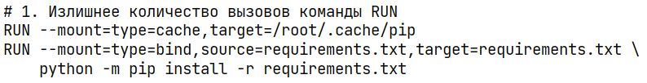
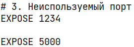
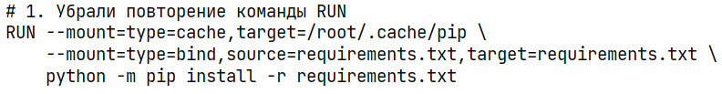
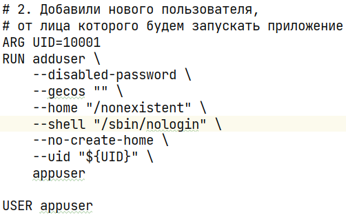
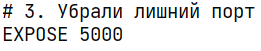

# Плохие практики
 
Команду RUN можно было вызвать один раз, добавив "\ " в конце первой строки.
Это замедляет сборку образа и увеличивает его размер. 
 
Использование суперпользователя вместо непривилигированного пользователя
приводит к угрозам безопасности:
есть риск эксплоита контейнерного приложения
для получения доступа к управлению хостом,
и в целом использование суперпользователя - это постоянный риск
нарушения изоляции между контейнером и хостом
и потенциальные изменения в самом хосте,
так как контейнер и хост работают с общим ядром системы. 
 
Ненужные операции замедляют сборку образа,
ухудшают читабельность кода.
В категорию подобных плохих практики
в целом входит любой излишний код и данные в Dockerfile
(будь то бесполезные команды, ненужные пакеты и т. д.) 
# Исправление плохих практик
 
Оптимизируем размер и скорость сборки образа. 
 
Новый пользователь ограничен и используется исключительно для образов
этого Dockerfile. 
 
Избавляемся от бесцельных команд. 

