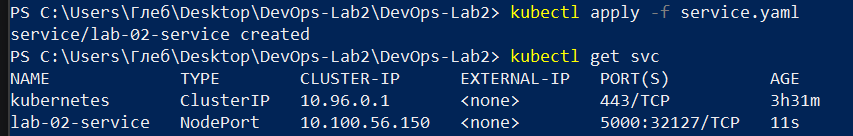
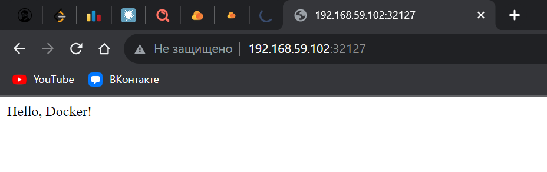

# Плохие практики
 
Команду RUN можно было вызвать один раз, добавив "\ " в конце первой строки.
Это замедляет сборку образа и увеличивает его размер. 
 
Использование суперпользователя вместо непривилигированного пользователя
приводит к угрозам безопасности:
есть риск эксплоита контейнерного приложения
для получения доступа к управлению хостом,
и в целом использование суперпользователя - это постоянный риск
нарушения изоляции между контейнером и хостом
и потенциальные изменения в самом хосте,
так как контейнер и хост работают с общим ядром системы. 
 
Ненужные операции замедляют сборку образа,
ухудшают читабельность кода.
В категорию подобных плохих практики
в целом входит любой излишний код и данные в Dockerfile
(будь то бесполезные команды, ненужные пакеты и т. д.) 
# Исправление плохих практик
 
Оптимизируем размер и скорость сборки образа. 
 
Новый пользователь ограничен и используется исключительно для образов
этого Dockerfile. 
 
Избавляемся от бесцельных команд. 
# Плохие практики при использовании контейнера
 
Запуск контейнера без значимого имени. 
 
Оставление ненужных контейнеров включёнными – трата ресурсов ПК. 

# Задание со звездочкой!
Во втором задании нужно было поднять кластер Kubernetes, запустить наш контейнер в нём, при этом всё описано кодом. Само собой, должны быть deployment и service, а приложение, работающее внутри контейнера должно открываться локально на моем браузере. Приступаем.

## Поднимаем кластер
Поднимем мы его с помощью minicube, а в качестве драйвера будем использовать virtualbox. Ниже на рисунке показан запуск кластера с помощью команды `minikube start`. 
 

Проверяем работоспособность нашего кластера с помощью `kubectl get componentstatuses`. Также можно заглянуть в VirtualBox и увидеть, что наш кластер работает. 
 

## Загружаем образ в репозиторий
Кластер подняли, теперь пора загрузить образ, полученный из нашего докер файла (во всех дальнейших примерах будет использоваться "хороший" докер файл, для плохого файла все шаги те же). 
Для начала давайте получим образ из нашего файла с помощью команды `docker build`. В качестве тега установим myk8sapp. 
 

В качестве репозитория будем использовать всеми любимый Docker Hub, необходимо залогинниться в него, предварительно создав публичный репозиторий.  
 

Самое время запушить наш образ в созданный репозиторий с помощью команды `docker push`. 
 

Готово! Теперь наш образ можно загрузить из репозитория с помощью `docker pull`.

## Описываем deployment и service 

Начнём с деплоймента. Для начала создадим файлик deployment.yaml, где опишем всю конфигурацию. Содержимое файлика представлено на скриншоте. 
 

Из интересного в нём: будет создаваться три пода (поле replicas), в которых будут запущены контейнеры с нашим образом, открыт 5000 порт. Запустим наш deployment в кластере с помощью команды `kubectl apply`. 
 
Как мы можем убедиться, наши три пода бегут, а значит всё замечательно.

Поступим аналогично и с нашим сервисом. Создаем service.yaml: 
 

Наш сервис будет типа NodePort, чтобы все ноды были доступны на одном порте. Порт открыт 5000.
С помощью того же `kubectl apply` запускаем наш сервер и проверяем, всё ли в порядке:  
 

Воу, все работает! Получим URL у нашего сервиса с помощью `minikube service <service_name> --url`:

## Открываем в бразуере
Проверим, всё ли у нас правильно: открываем браузер и переходим по полученному URL... Что мы видим? Всё работает! 

